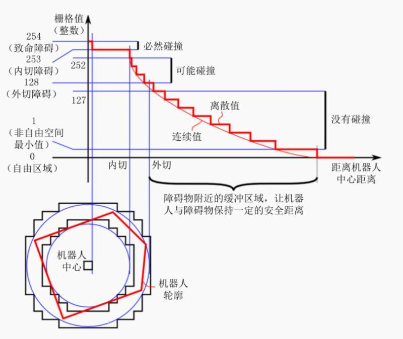

## demo 42

仿真环境下的机器人导航（路径规划）

在ROS的navigation功能包中集成了move_base 功能包，以此来实现路径规划。

-----

### move_base 简介
move_base 提供了基于动作（ros action）的路径规划，可以根据指定的目标点控制机器人底盘运动至目标位置，并且在运动过程中会持续反馈机器人当前的状态（因为action是可以持续反馈的），move_base主要由 **全局路径规划** 和 **本地路径规划** 两大部分组成。


【题外话】因为赵虚左的课程中将 ros action 放到了比较后面的位置，但我这里在 demo31 的时候就引入了 action 的内容，这部分东西和 msg、srv 非常相似，所以这里仍然建议的是按照demo的顺序结合赵虚左的课程执行下去，如果遇到了课程中没有的也不要跳跃，因为后面会用到。

-----

### move_base 代价地图

1. 在之前的demo中已经可以使用 SLAM 来创建全局地图了，但在导航过程中这种静态地图是不可用的，因为障碍物可能出现增减，因此需要实时获取障碍物信息。
2. 机器人通过一个障碍物时以不同的方式运动会有不同的代价，即一定发生碰撞、可能发生碰撞、一定不会发生碰撞。

因此最好是在障碍物附近设置一定的**膨胀区**来阻止机器人进入。

同路径规划一样，代价地图也分为 **全局代价地图** 和 **本地代价地图**。

一张代价地图通常有多层叠加：
1. 静态层；--- SLAM 绘制的静态地图
2. 障碍物层； --- 导航中传感器感知的障碍物
3. 膨胀层； --- 为了避免碰撞而设计的安全区
4. 自定义层； --- 根据业务自己设置的一些地图数据

其中自定义层是指在导航过程中可以添加一堵虚拟强来让机器人规避一段区域，这个墙在现实中或者 SLAM 建模过程中都没出现过。

----

### 碰撞算法

此处可以直接看赵虚左的知乎专栏 [ROS入门教程-理论与实践（7.2.4 导航实现04_路径规划）](https://zhuanlan.zhihu.com/p/364310614)，



-----

### move_base 使用

因为 move_base 被设计用来适应多种不同类型的机器人，机器人之间的尺寸、质量、传感器类型、速度、场景均可能不同，这些都会影响到路径规划结果，因此需要在使用之前将自己的机器人数据配置进去。

1. 编写launch文件模板；
2. 编写配置文件；
3. 集成和导航相关的launch文件；
4. 运行；

同之前的两节一样，在创建功能包的时候需要添加以下几个依赖：
```txt
gmapping amcl map_server move_base
```

----

### **Step 1**：添加参数文件

然后将demo41中的几个文件夹拷贝进来，并在创建一个move_base_path.launch，从 赵虚左 的博客 [ROS入门教程-理论与实践（7.2.4 导航实现04_路径规划）](https://zhuanlan.zhihu.com/p/364310614) 中复制：

**move_base_path.launch**
```xml
<launch>

    <node pkg="move_base" type="move_base" respawn="false" name="move_base_node" output="screen" clear_params="true">
        <rosparam file="$(find demo)/param/costmap_common_params.yaml" command="load" ns="global_costmap" />
        <rosparam file="$(find demo)/param/costmap_common_params.yaml" command="load" ns="local_costmap" />
        <rosparam file="$(find demo)/param/local_costmap_params.yaml" command="load" />
        <rosparam file="$(find demo)/param/global_costmap_params.yaml" command="load" />
        <rosparam file="$(find demo)/param/base_local_planner_params.yaml" command="load" />
    </node>

</launch>
```

根据上面的文件名创建文件，继续从上面的连接中复制内容，并按照自己机器人的情况进行修改。

**costmap_common_params.yaml**
```yaml
# 机器人半径，需要考虑到机器人车轮突出的地方
robot_radius: 0.12 #圆形
# footprint: [[-0.12, -0.12], [-0.12, 0.12], [0.12, 0.12], [0.12, -0.12]] #其他形状

obstacle_range: 3.0 # 用于障碍物探测，比如: 值为 3.0，意味着检测到距离小于 3 米的障碍物时，就会引入代价地图
raytrace_range: 3.5 # 用于清除障碍物，比如：值为 3.5，意味着清除代价地图中 3.5 米以外的障碍物


#膨胀半径，扩展在碰撞区域以外的代价区域，使得机器人规划路径避开障碍物
inflation_radius: 0.2
#代价比例系数，越大则代价值越小
cost_scaling_factor: 3.0

#地图类型
map_type: costmap
#导航包所需要的传感器
observation_sources: scan
# 导航坐标系的名称
scan: {sensor_frame: laser, data_type: LaserScan, topic: scan, marking: true, clearing: true}
```

**local_costmap_params.yaml**
```yaml
local_costmap:
  global_frame: odom #里程计坐标系
  robot_base_frame: footprint #机器人坐标系

  update_frequency: 10.0 #代价地图更新频率
  publish_frequency: 10.0 #代价地图的发布频率
  transform_tolerance: 0.5 #等待坐标变换发布信息的超时时间

  static_map: false  #不需要静态地图，可以提升导航效果
  rolling_window: true #是否使用动态窗口，默认为false，在静态的全局地图中，地图不会变化
  width: 3 # 局部地图宽度 单位是 m
  height: 3 # 局部地图高度 单位是 m
  resolution: 0.05 # 局部地图分辨率 单位是 m，一般与静态地图分辨率保持一致
```

**global_costmap_params.yaml**
```yaml
global_costmap:
  global_frame: map #地图坐标系
  robot_base_frame: footprint #机器人坐标系
  # 以此实现坐标变换

  update_frequency: 1.0 #代价地图更新频率
  publish_frequency: 1.0 #代价地图的发布频率
  transform_tolerance: 0.5 #等待坐标变换发布信息的超时时间

  static_map: true # 是否使用一个地图或者地图服务器来初始化全局代价地图，如果不使用静态地图，这个参数为false.
```

**base_local_planner_params.yaml**
```yaml
TrajectoryPlannerROS:

# Robot Configuration Parameters
  max_vel_x: 0.5 # X 方向最大速度
  min_vel_x: 0.1 # X 方向最小速速

  max_vel_theta:  1.0 # 
  min_vel_theta: -1.0
  min_in_place_vel_theta: 1.0

  acc_lim_x: 1.0 # X 加速限制
  acc_lim_y: 0.0 # Y 加速限制
  acc_lim_theta: 0.6 # 角速度加速限制

# Goal Tolerance Parameters，目标公差
  xy_goal_tolerance: 0.10
  yaw_goal_tolerance: 0.05

# Differential-drive robot configuration
# 是否是全向移动机器人
  holonomic_robot: false

# Forward Simulation Parameters，前进模拟参数
  sim_time: 0.8
  vx_samples: 18
  vtheta_samples: 20
  sim_granularity: 0.05
```

----

### **Step 2**：集成进launch文件

为了实现导航功能，需要启动地图服务（nav_map_load.launch）、amcl定位（amcl.lacunch）、move_base path（move_base_path.launch）。

**move_base_test.launch**
```xml
<launch>
    <!-- 地图服务 -->
    <include file="$(find demo)/launch/nav_map_load.launch" />
    <!-- amcl -->
    <include file="$(find demo)/launch/amcl.launch" />
    <!-- move base -->
    <include file="$(find demo)/launch/move_base_path.launch" />

    <!-- rviz -->
    <node pkg="joint_state_publisher" name="joint_state_publisher" type="joint_state_publisher" />
    <node pkg="robot_state_publisher" name="robot_state_publisher" type="robot_state_publisher" />
    <node pkg="rviz" type="rviz" name="rviz_node" />

</launch>
```

----

### **Step 3**：测试
1. 启动gazebo仿真环境；
2. 启动move_base_test.launch文件；
3. 在Rviz中添加组建（RobotModel、Map、PoseArray、LaserScan、Odometry）；

在工具栏中选择 "2D Nav Goal" 然后在地图上随便点上一点然后机器人就会自动过去。

【注意】在添加组件的时候可以在 “Display Name” 中修改组件名。

**全局代价地图**：“Add” -> “Map” 选择 “Color Scheme” -> "costmap"。

**本地代价地图**：“Add” -> “Map” 选择 “Color Scheme” -> "map"。

**全局路径规划**：“Add” -> “Path” 选择 “Topic” -> “NavfnROS”。

**本地路径规划**：“Add” -> “Path” 选择 “Topic” -> “local_plan”。

---

为了防止机器人全局路径规划和本地路径规划不符而导致机器人进入膨胀区假死的情况（在noetic本版之前很常见），可以采用以下策略：
* 全局代价地图可以将膨胀半径和障碍物设置偏大；
* 本地代价地图可以将膨胀半径和障碍物设置篇小；

这样可以在全局规划时让路径尽可能远离障碍物，而本地路径规划时即使进入了全局膨胀空间也会不会进入本地膨胀空间，避免陷入假死的情况。

在运行过程中可以在 gazebo 中直接添加障碍物，机器人能实现动态避障。