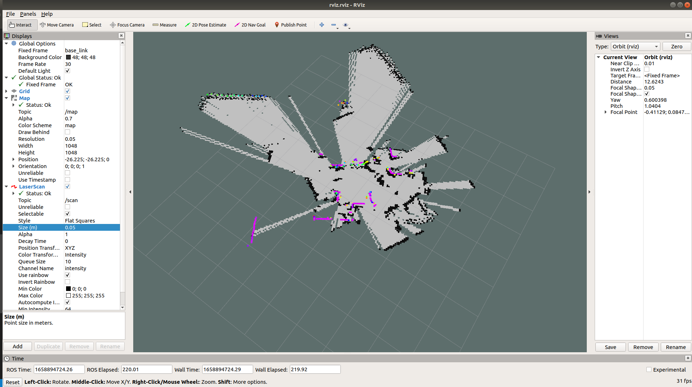

## demo 49 

这个demo展示了如何使用一个真实的激光雷达进行建图（Hector）。

首先需要安装 ROS 的 Hector 功能包。
```shell
$ sudo apt-get install ros-melodic-hector-slam
```

【注意】建图、定位、导航是三个不同的步骤。

ROS官方也集成了多种不同的SLAM功能包，下面是最常用的三种解决方案和需要的输入数据：
* Gmapping：laser + odom
* Hectro：laser
* Cartographer：laser + IMU + odom

其中 Hector 算法是三种SLAM算法中对硬件要求最低的，仅仅需要一个激光雷达就可以，这也导致其建图效果远不如另外两者，但初学的话绝对够用。

这里使用的是 **轮趣科技 WHEELTEC** 的激光雷达传感器 LD14，购买和安装教程可以看其技术链接，主要是安装上 ROS 的串口文件，最好还是把下面有用的和没用的都先装上，这里参考了 CSDN 博主 **一颗大椰子** 的文章[移植树莓派上的功能包到rk3288上](https://blog.csdn.net/xuoeigan/article/details/124528922)。尽管写的是树莓派的教程，但我在amd笔记本上也可以运行。

```shell
$ sudo apt-get install ros-melodic-serial
$ sudo apt-get install libsdl-dev
$ sudo apt-get install ros-melodic-bfl
$ sudo apt-get install ros-melodic-tf2-sensor-msgs
$ sudo apt-get install ros-melodic-move-base-msgs
```

----

### **Step 1**：下载商家提供的功能包 & 编译
```shell
$ cd src
$ git clone https://github.com/ldrobotSensorTeam/ldlidar_sl_ros.git
$ cd ..
$ catkin_make
```
【注意】如果这里报错了一定要当场解决，大部分报错原因是没有安装完依赖，我这台机子已经来来回回装了很多次了，所以忘了出现过哪些报错。

-----

### **Step 2**：编写 Hectro 的 launch 文件
这里的 launch 文件可以写在自己的 demo/launch 文件夹下，也可以直接写在刚刚git clone下来的 ldlidar_sl_ros/launch 文件夹下，这里选择的是前者，需要编写三个launch 文件，此处参考了 **Danny_a44d** 的文章 [ROS 用hector_slam建图](https://www.jianshu.com/p/429e59d48322)：


**run.launch**
```xml
<launch>
    <param name="/use_sim_time" value="false"/>
      <node pkg="rviz" type="rviz" name="rviz" args="-d $(find demo)/config/rviz.rviz"/>
    <include file="$(find demo)/launch/hector_mapping.launch"/>

    <include file="$(find demo)/launch/geotiff_mapper.launch">
      <arg name="trajectory_source_frame_name" value="scanmatcher_frame"/>
    </include>
</launch>
```

因为厂商提供的SDK本身就将数据发布到了 /scan 话题上，而且也新建了base_link这个坐标系，所以这部分内容不需要修改，如果你的激光雷达是别的话题，那么需要修改话题和base_frame

**hector_mapping.launch**
```xml
<launch>

    <node pkg="hector_mapping" type="hector_mapping" name="hector_mapping"   output="screen">
        <param name="pub_map_odom_transform" value="true"/>
        <param name="map_frame" value="map" />
        <param name="base_frame" value="base_link" />
        <param name="odom_frame" value="base_link" />

        <!-- Map size / start point -->
        <param name="map_resolution" value="0.050"/>
        <param name="map_size" value="1048"/>
        <param name="map_start_x" value="0.5"/>
        <param name="map_start_y" value="0.5" />
        <param name="map_multi_res_levels" value="2" />

        <!-- Map update parameters -->
        <param name="update_factor_free" value="0.4"/>
        <param name="update_factor_occupied" value="0.9" />   
        <param name="map_update_distance_thresh" value="0.4"/>
        <param name="map_update_angle_thresh" value="0.06" />
        <param name="laser_z_min_value" value = "-1.0" />
        <param name="laser_z_max_value" value = "1.0" />
    </node>

    <node pkg="tf" type="static_transform_publisher" name="base_to_laser_broadcaster" args="0 0 0 0 0 0 /base_link /laser_frame 100" /> 

</launch>
```

**geotiff_mapper.launch**
```xml
<launch>
    <arg name="trajectory_source_frame_name" default="/base_link"/>
    <arg name="trajectory_update_rate" default="4"/>
    <arg name="trajectory_publish_rate" default="0.25"/>

    <node pkg="hector_trajectory_server" type="hector_trajectory_server" name="hector_trajectory_server" output="screen">
        <param name="target_frame_name" type="string" value="/map" />
        <param name="source_frame_name" type="string" value="$(arg trajectory_source_frame_name)" />
        <param name="trajectory_update_rate" type="double" value="$(arg trajectory_update_rate)" />
        <param name="trajectory_publish_rate" type="double" value="$(arg trajectory_publish_rate)" />
    </node>

    <node pkg="hector_geotiff" type="geotiff_node" name="hector_geotiff_node" output="screen" launch-prefix="nice -n 15">
        <remap from="map" to="/dynamic_map" />
        <param name="map_file_path" type="string" value="$(find hector_geotiff)/maps" />
        <param name="map_file_base_name" type="string" value="uprobotics" />
        <param name="geotiff_save_period" type="double" value="0" />
        <param name="draw_background_checkerboard" type="bool" value="true" />
        <param name="draw_free_space_grid" type="bool" value="true" />
    </node>
</launch>
```

-----

### **Step 3**：启动节点
1. 链接上激光雷达后还要给USB设备添加可执行权限，否则无法从串口中读出数据。
```shell
$ sudo chmod 777 /dev/ttyUSB0
```

2. 启动雷达数据的发布节点
```shell
$ catkin_make
$ source devel/setup.bash
$ roslaunch ldlidar_sl_ros ld14.launch
```
因为这里只需要雷达数据，rviz节点是我们自己写的，所以只要启动这个节点就可以。

3. 启动 Hector 节点来建图
```shell
$ roslaunch demo run.launch
```

----

### **Step 4**：在rviz上调整
1. Global Options -> Fixed Frame -> "base_link";
2. Add -> Map -> Topic -> /map;
3. Add -> LaserScan -> Topic -> /scan;
4. LaserScan -> Size -> 0.05;


